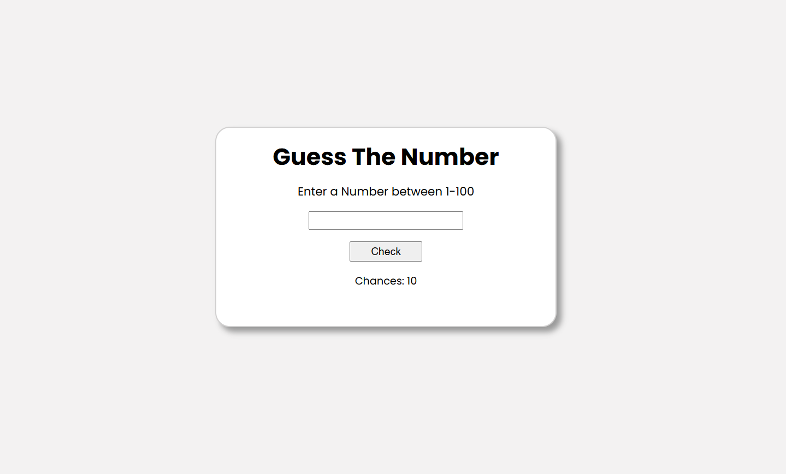

# Number Guessing Game

A simple web-based number guessing game where the player has to guess a randomly generated number between 1 and 100 within 10 chances.

### **Features**
- **Random Number Generation**: A random number is generated at the start of the game between 1 and 100.
- **Limited Chances**: The player has 10 chances to guess the number.
- **Feedback Mechanism**: The game provides hints whether the guess is too high or too low.
- **Winning and Losing Conditions**: The game displays a success message if the correct number is guessed or a losing message if the player runs out of chances.
- **Input Validation**: Ensures the player enters a valid number between 1 and 100.

### **Technologies Used**
- **HTML**: Provides the structure and layout of the game interface.
- **CSS**: Styles the game interface, making it visually appealing.
- **JavaScript**: Implements the game logic, including number generation, input validation, and chance tracking.

### **How to Play**
1. Enter a number between 1 and 100 in the input field.
2. Click the "Check" button or press "Enter" to submit your guess.
3. The game will inform you whether your guess was too high, too low, or correct.
4. You have 10 chances to guess the correct number. If you run out of chances, you lose.
5. If you guess correctly, the game will display a winning message with the number of chances used.

### **Game Image** 




### **Future Improvements**
- **Game Modes**: I will categorize this game into 3 difficulty modes:
  - **Easy**: Number range between 1-10
  - **Medium**: Number range between 1-100
  - **Hard**: Number range between 1-1000
- **High Scores**: Implement a feature to keep track of the player's best scores.
- **Timer**: Add a countdown timer for an extra challenge.
- **Sound Effects**: Add sound effects for correct/incorrect guesses to enhance user experience.
- **UI Enhancements**: Improve the styling and animations for a more polished user interface.
- **Multiple Player Mode**: Allow two players to compete against each other for the best score.

### **Author**
- **Rosis Sharma**: [Your GitHub Profile](https://github.com/rosheesh7)
```
